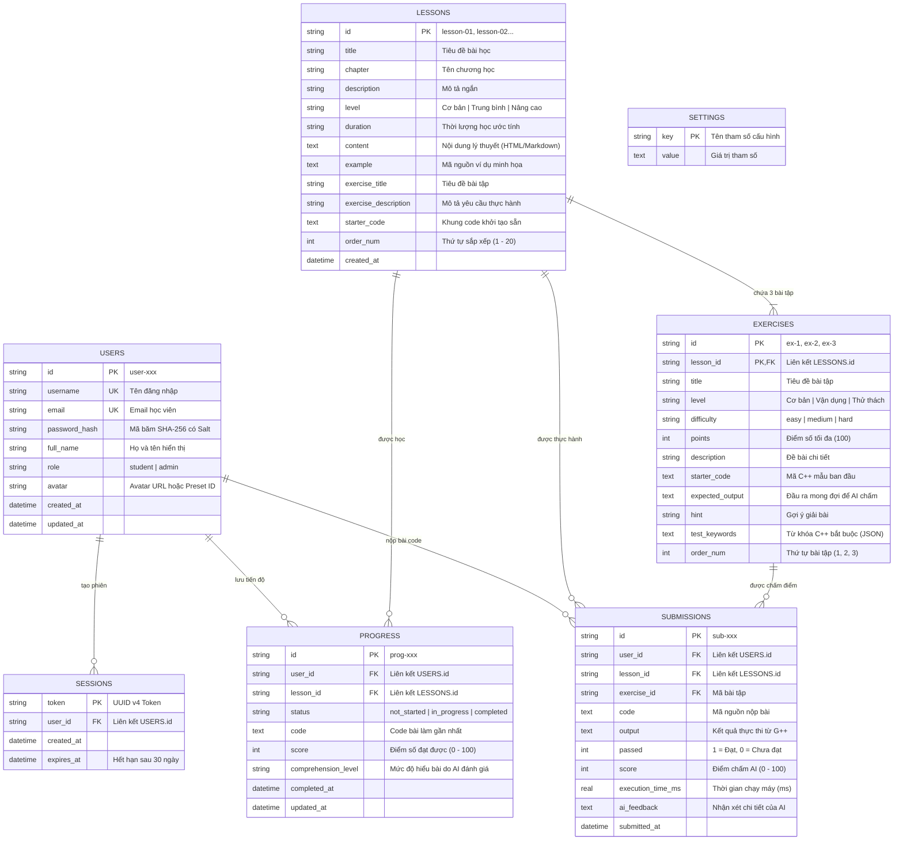

# 🗄️ TÀI LIỆU CƠ SỞ DỮ LIỆU - CODELEARN C++ ACADEMY

Tài liệu thiết kế kiến trúc, lược đồ thực thể quan hệ (ERD), từ điển dữ liệu và hướng dẫn vận hành cơ sở dữ liệu cho nền tảng **CodeLearn C++**.

---

## 1. Tổng Quan Kiến Trúc Database

- **Hệ quản trị mặc định:** SQLite 3 (Lưu trữ tập trung tại `backend/database.db`).
- **Khả năng tương thích:** Chuẩn ANSI SQL, sẵn sàng chuyển đổi (migration) sang **MySQL 8.0+** hoặc **PostgreSQL 14+** qua tệp `backend/schema.sql` và `backend/seed.sql`.
- **Cơ chế lưu trữ:**
  - **Server Mode:** Lưu trữ thực thể và phiên người dùng trong SQLite, đảm bảo ACID, hỗ trợ Foreign Keys Cascade.
  - **Client Mode (Offline-First):** Tự động đồng bộ sang `localStorage` để học viên vẫn học tập và làm bài mượt mà ngay cả khi mất mạng.

---

## 2. Sơ Đồ Thực Thể Liên Kết (Entity-Relationship Diagram)



---

## 3. Từ Điển Dữ Liệu Chi Tiết (Data Dictionary)

### 3.1. Bảng `users`
| Tên cột | Kiểu dữ liệu | Ràng buộc | Mô tả |
| :--- | :--- | :--- | :--- |
| `id` | `TEXT` | `PRIMARY KEY` | Định danh duy nhất (VD: `user-admin`, `user-student`) |
| `username` | `TEXT` | `UNIQUE NOT NULL` | Tên tài khoản đăng nhập (chữ, số, `_`, `.`) |
| `email` | `TEXT` | `UNIQUE NOT NULL` | Email liên hệ của học viên |
| `password_hash` | `TEXT` | `NOT NULL` | Mật khẩu băm an toàn SHA-256 kèm chuỗi Salt bí mật |
| `full_name` | `TEXT` | `NOT NULL` | Tên họ đầy đủ của học viên / Quản trị viên |
| `role` | `TEXT` | `DEFAULT 'student'` | Quyền hạn: `student` (học viên) hoặc `admin` (quản trị) |
| `avatar` | `TEXT` | `DEFAULT ''` | Tên mẫu preset (VD: `preset-coder-boy`) hoặc Base64 ảnh |
| `created_at` | `TEXT` | `NOT NULL` | Thời gian tạo tài khoản (ISO 8601) |
| `updated_at` | `TEXT` | `NOT NULL` | Thời gian cập nhật gần nhất |

### 3.2. Bảng `lessons`
| Tên cột | Kiểu dữ liệu | Ràng buộc | Mô tả |
| :--- | :--- | :--- | :--- |
| `id` | `TEXT` | `PRIMARY KEY` | Mã bài học (`lesson-01`, `lesson-02`,..., `lesson-20`) |
| `title` | `TEXT` | `NOT NULL` | Tiêu đề bài học |
| `chapter` | `TEXT` | `NOT NULL` | Tên chương (Chương 1 đến Chương 7) |
| `description` | `TEXT` | `NOT NULL` | Mô tả tóm tắt nội dung |
| `level` | `TEXT` | `NOT NULL` | Mức độ: Cơ bản / Trung bình / Nâng cao |
| `duration` | `TEXT` | `NOT NULL` | Thời gian học ước lượng (VD: `20 phút`, `35 phút`) |
| `content` | `TEXT` | `NOT NULL` | Nội dung lý thuyết định dạng HTML chuẩn SEO |
| `example` | `TEXT` | `NOT NULL` | Mã C++ mẫu hoàn chỉnh có chú thích |
| `exercise_title`| `TEXT` | `NOT NULL` | Tiêu đề tóm tắt bài tập thực hành |
| `exercise_description` | `TEXT` | `NOT NULL` | Đề bài yêu cầu |
| `starter_code` | `TEXT` | `NOT NULL` | Khung mã C++ sẵn sàng trong code editor |
| `order_num` | `INTEGER`| `NOT NULL` | Thứ tự hiển thị tăng dần |
| `created_at` | `TEXT` | `NOT NULL` | Ngày tạo bài học |

### 3.3. Bảng `exercises`
Mỗi bài học được thiết kế chuẩn mực gồm **3 bài tập phân cấp**:
1. `ex-1`: Cấp độ **Cơ bản** (`easy`, 100 điểm) - Khắc sâu cú pháp cơ bản.
2. `ex-2`: Cấp độ **Vận dụng** (`medium`, 100 điểm) - Xây dựng tư duy giải quyết vấn đề.
3. `ex-3`: Cấp độ **Thử thách** (`hard`, 100 điểm) - Nâng cao thuật toán & tối ưu mã nguồn.

| Tên cột | Kiểu dữ liệu | Ràng buộc | Mô tả |
| :--- | :--- | :--- | :--- |
| `id` | `TEXT` | `NOT NULL` | Mã bài tập (`ex-1`, `ex-2`, `ex-3`) |
| `lesson_id` | `TEXT` | `NOT NULL, FK` | Khóa ngoại trỏ đến `lessons.id` (Xóa bài -> Xóa bài tập) |
| `title` | `TEXT` | `NOT NULL` | Tiêu đề cụ thể của bài tập |
| `level` | `TEXT` | `NOT NULL` | Cơ bản / Vận dụng / Thử thách |
| `difficulty` | `TEXT` | `NOT NULL` | `easy` / `medium` / `hard` |
| `points` | `INTEGER`| `DEFAULT 100` | Điểm số bài tập |
| `description` | `TEXT` | `NOT NULL` | Yêu cầu bài tập chi tiết |
| `starter_code`| `TEXT` | `NOT NULL` | Code ban đầu trong cửa sổ Editor |
| `expected_output` | `TEXT`| `DEFAULT ''` | Kết quả in ra mong đợi (để đối chiếu) |
| `hint` | `TEXT` | `DEFAULT ''` | Gợi ý thuật toán hoặc hàm cần dùng |
| `test_keywords`| `TEXT` | `DEFAULT '[]'` | Mảng JSON các từ khóa cú pháp C++ bắt buộc |
| `order_num` | `INTEGER`| `NOT NULL` | Thứ tự 1, 2 hoặc 3 trong bài học |

### 3.4. Bảng `progress`
Lưu trạng thái học tập của từng học viên trên từng bài học:
- `status`: `'not_started'`, `'in_progress'`, `'completed'`.
- `score`: Điểm bài tập học viên đạt được (0 đến 100).
- `comprehension_level`: Đánh giá của AI (VD: *"Hiểu bài xuất sắc (90%+)"*, *"Đạt yêu cầu (75%+)"*).

### 3.5. Bảng `submissions`
Lịch sử tất cả các lượt chạy & nộp bài code thực tế của học viên:
- `code`: Mã C++ học viên gửi lên.
- `output`: Kết quả do trình biên dịch MSYS2 `g++ 13.2.0` in ra.
- `passed`: `1` (Đạt bài tập) hoặc `0` (Chưa đạt).
- `execution_time_ms`: Thời gian chạy thực thi trên CPU tính bằng mili-giây.
- `ai_feedback`: Nhận xét phân tích điểm mạnh (strengths) và điểm cần khắc phục (improvements).

---

## 4. Các Tệp Dữ Liệu Cung Cấp Sẵn Trong Thư Mục `backend/`

| Tệp tin | Định dạng | Mục đích sử dụng |
| :--- | :---: | :--- |
| [`backend/database.db`](file:///d:/Wed/cpp-basic-academy/backend/database.db) | SQLite Binary | Tệp cơ sở dữ liệu vật lý đang hoạt động trực tiếp của hệ thống. |
| [`backend/schema.sql`](file:///d:/Wed/cpp-basic-academy/backend/schema.sql) | ANSI SQL DDL | Kịch bản tạo toàn bộ 7 bảng dữ liệu, chỉ mục (Index) và ràng buộc khóa ngoại. |
| [`backend/seed.sql`](file:///d:/Wed/cpp-basic-academy/backend/seed.sql) | SQL INSERT | Dữ liệu mẫu toàn bộ 20 bài học, 60 bài tập, 2 tài khoản mặc định và cài đặt. |
| [`backend/database_dump.json`](file:///d:/Wed/cpp-basic-academy/backend/database_dump.json) | JSON Format | Toàn bộ dữ liệu trích xuất dạng JSON tiêu chuẩn cho API / Frontend hoặc NoSQL. |
| [`backend/database_manager.py`](file:///d:/Wed/cpp-basic-academy/backend/database_manager.py) | Python CLI | Công cụ dòng lệnh hỗ trợ sao lưu, phục hồi, kiểm tra toàn vẹn và xuất dữ liệu. |
| `backend/backups/` | Thư mục | Nơi lưu trữ các bản sao lưu database tự động (`backup_YYYYMMDD_HHMMSS.db`). |

---

## 5. Hướng Dẫn Vận Hành & Quản Lý Cơ Sở Dữ Liệu

### 5.1. Xem Thống Kê & Trạng Thái Database (CLI)
```powershell
python backend/database_manager.py stats
```
*Kết quả mẫu:*
```text
============================================================
📊 THỐNG KÊ CƠ SỞ DỮ LIỆU CODELEARN C++ (DATABASE DASHBOARD)
============================================================
• Đường dẫn file : backend/database.db
• Kích thước     : 144.0 KB
• Trạng thái     : HEALTHY (Integrity: ok)
• Bản sao lưu    : 1 bản lưu trong backend/backups/
------------------------------------------------------------
Chi tiết các bảng dữ liệu:
  - [USERS       ]:    3 bản ghi
  - [SESSIONS    ]:    6 bản ghi
  - [LESSONS     ]:   20 bản ghi
  - [EXERCISES   ]:   60 bản ghi
  - [PROGRESS    ]:    1 bản ghi
  - [SUBMISSIONS ]:    1 bản ghi
  - [SETTINGS    ]:    0 bản ghi
============================================================
```

### 5.2. Tạo Bản Sao Lưu Database (Backup)
```powershell
python backend/database_manager.py backup
```
*Hệ thống sẽ tạo tệp an toàn dạng `backend/backups/backup_20261005_151705.db`.*

### 5.3. Phục Hồi Database Từ Bản Sao Lưu (Restore)
```powershell
python backend/database_manager.py restore backup_20261005_151705.db
```

### 5.4. Xuất Lại Tệp SQL & JSON Mới Nhất (Export)
```powershell
python backend/database_manager.py export
```

### 5.5. Kiểm Tra Tính Toàn Vẹn Khóa Ngoại (Integrity Check)
```powershell
python backend/database_manager.py check
```

---

## 6. Hướng Dẫn Chuyển Đổi Sang MySQL Hoặc PostgreSQL (Production Migration)

Khi triển khai lên máy chủ Cloud phục vụ hàng ngàn học viên đồng thời:
1. Tạo database mới trên MySQL hoặc PostgreSQL:
   ```sql
   CREATE DATABASE codelearn_cpp CHARACTER SET utf8mb4 COLLATE utf8mb4_unicode_ci;
   ```
2. Thực thi tệp lược đồ:
   ```bash
   mysql -u root -p codelearn_cpp < backend/schema.sql
   ```
3. Nạp dữ liệu mẫu 20 bài học và 60 bài tập:
   ```bash
   mysql -u root -p codelearn_cpp < backend/seed.sql
   ```
4. Đổi chuỗi kết nối trong `backend/database.py` sang Driver tương ứng (như `pymysql` hoặc `psycopg2`).
